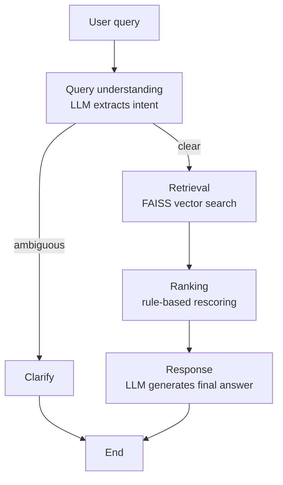

# Auto Parts Search & Recommendation Agent

An agentic AI pipeline built with LangGraph that turns natural-language auto parts
queries into ranked, explained recommendations — using local, free tooling end to end
(no paid API required).

## What it does

A user asks something like *"Recommend brake pads for a 2018 Honda Civic"*, and the
pipeline:
1. Extracts structured intent (part category, make, model, year) from the query
2. Retrieves semantically similar parts from a vector store
3. Re-ranks candidates against the extracted intent
4. Generates a natural-language recommendation with reasoning

## Architecture



## Tech stack

| Component | Tool | Role |
|---|---|---|
| Orchestration | [LangGraph](https://github.com/langchain-ai/langgraph) | Manages pipeline state and conditional routing between nodes |
| Embeddings | Hugging Face `sentence-transformers/all-MiniLM-L6-v2` | Converts text to 384-dim vectors for semantic search |
| Vector store | [FAISS](https://github.com/facebookresearch/faiss) | Stores and searches part embeddings (nearest-neighbor lookup) |
| LLM | [Ollama](https://ollama.com) running Llama 3.2 | Local, free inference for query understanding and response generation |
| UI | [Streamlit](https://streamlit.io) | Interactive front end |

Everything runs locally with no API costs.

## Setup

```bash
# 1. Install Ollama and pull the model
brew install ollama
ollama pull llama3.2

# 2. Install Python dependencies
pip install -r requirements.txt

# 3. Generate the synthetic catalog (or bring your own CSV)
python3 generate_catalog.py

# 4. Build the FAISS index
python3 embedding.py

# 5. Run the pipeline directly
python3 project.py

# 6. Or launch the Streamlit UI
streamlit run streamlit_app.py
```

## Known limitations

- Retrieval is pure semantic similarity — it doesn't filter by make/model before
  searching, so results can include parts for the wrong vehicle. Adding metadata
  filtering at the retrieval step is a planned improvement.
- Ranking is rule-based (weighted field matching), not learned from data — there's
  no training signal (clicks, purchases) available yet.
- No offline evaluation (NDCG/MRR) yet — ranking quality is currently assessed
  qualitatively.
